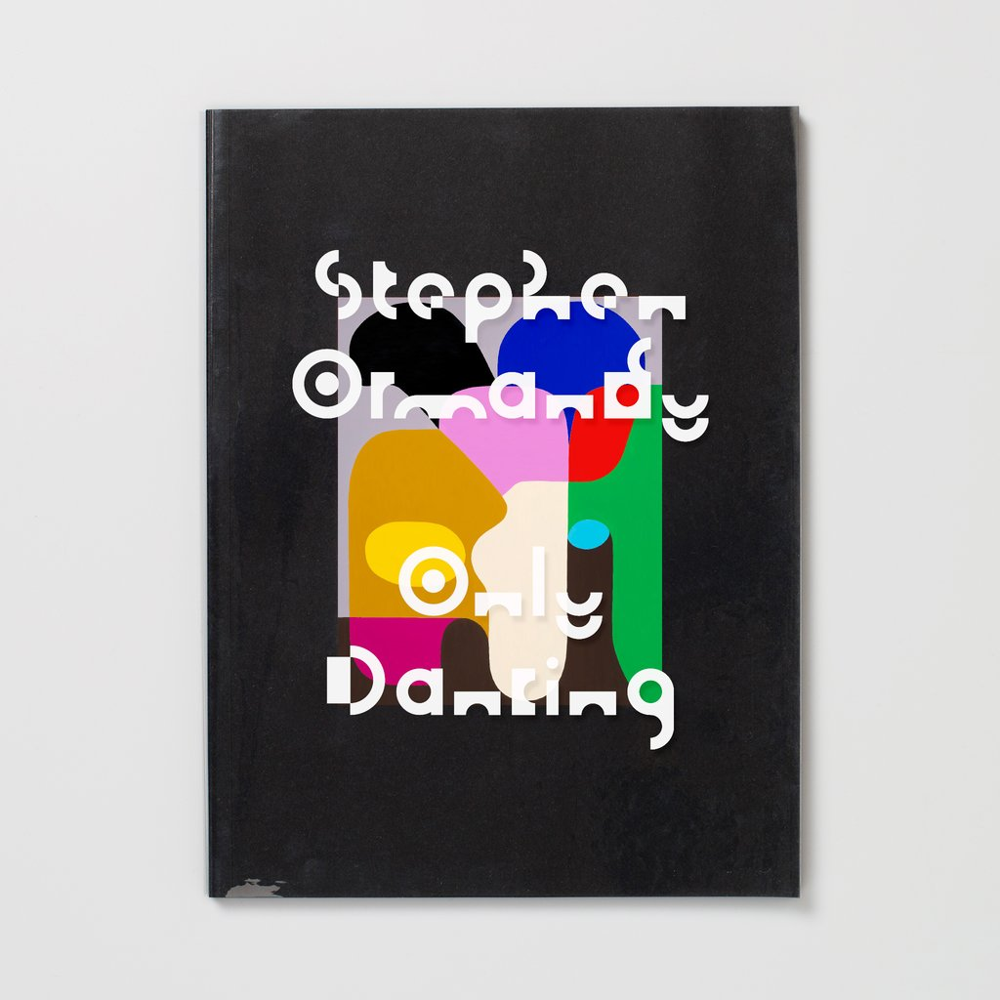
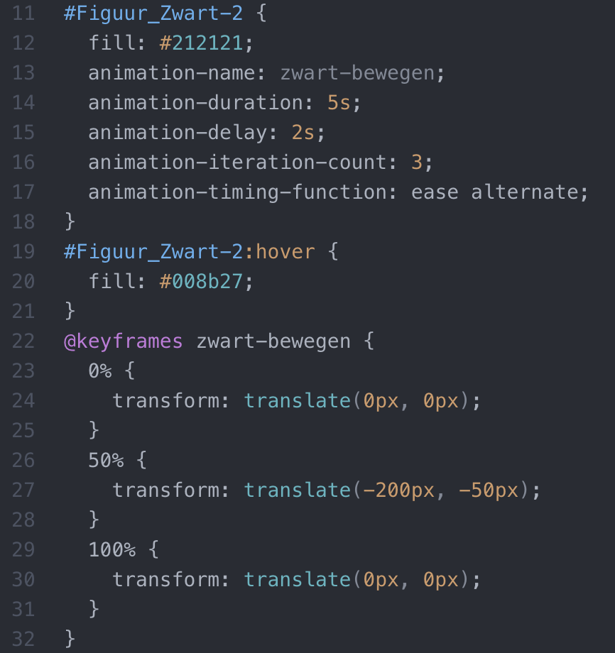
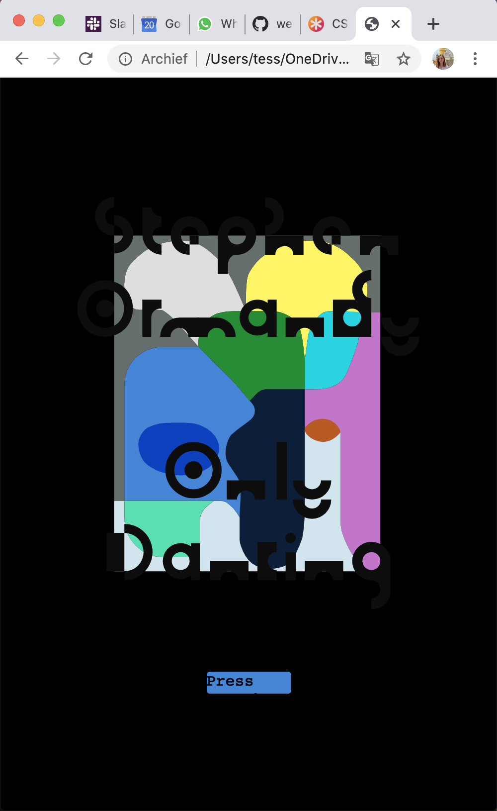
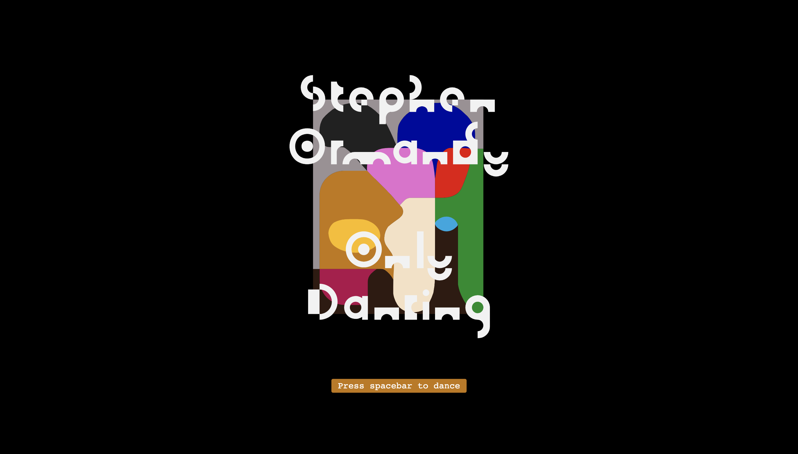

<h1>Webanimatie | Kunstwerk</h1>

<em>Note: zie in mijn repository de volledige versies van deze opdracht.</em>

<h3>Inleiding</h3>

Tijdens deze opdracht heb ik voor het eerst kennis gemaakt met HTML, CSS en Javascript. Allereerst koos ik een kunstwerk die ik vervolgens nagemaakt heb in een webbrowser. Het doel van deze opdracht was om interactie toe te voegen aan het kunstwerk en om te experimenteren CSS animaties en transities. Wat eerst een statisch kunstwerk was, is nu een dynamisch geheel.

<h3>Gekozen Kunstwerk</h3>

Het kunstwerk dat ik heb gekozen is een boekcover van het boek "Stephen Ormandy, Only Dancing". Stephen Ormandy is een Australische ontwerper en kunstenaar met een hele authentieke stijl. Zijn stijl is gelijk te herkennen aan de combinatie van meerdere kleurrijke organische vormen. Dit boek is geen werk van hem zelf, maar van Mark Gowing. In dit boek onderzoekt hij de stijl van Stephen. Het is de eerste publicatie die gewijd is aan het onderzoeken van Ormandy's levendige olieverfschilderijen en de speelsheid die hij toevoegt bij alles wat hij doet. Deze speelsheid wilde ik ook graag meegeven in mijn animaties.

<figure>
 
 <figcaption>Bron: https://formisteditions.co/products/stephen-ormandy-only-dancing</figcaption>
 </figure>
  

Dit kunstwerk heb ik gekozen omdat de vele verschillende kleuren mij aanspraken. Ik zag gelijk dingen die ik ermee kon doen. Daarnaast ga ik hiermee uit mijn comfort-zone omdat ik nog nooit met zo'n stijl gewerkt heb. Tijdens het zoeken naar een kunstwerk dacht ik ook praktisch na. Het is de eerste keer dat ik aan de slag ga met HTML, CSS en Javascript. Ik wilde dus dat het kunstwerk ook niet te ingewikkeld in elkaar stak.

<h3>Iteratie 1</h3>

Allereerst ben ik begonnen met het namaken van het kunstwerk in Illustrator. Dit bestand heb ik vervolgens geëxporteerd als SVG en in mijn html geplaatst. Vervolgens heb ik veel tijd gestoken in het ordenen van de SVG, kijken hoe dit werkt en het positioneren van de SVG op het scherm. Toen alles stond zoals ik het wilde hebben, ben ik gaan experimenteren met animaties in CSS. Daarbij maakte ik gebruik van keyframes. Hierbij heb ik verschillende bronnen gebruikt (zie bronnenlijst).

<h3>Iteratie 2</h3>

Tijdens de eerste iteratie heb ik mij vooral gefocust op CSS animatie. Deze animatie wilde ik nu interactief maken door middel van Javascript. Waar eerst de verschillende vlakken automatisch verplaatsten, moet je dit nu met een klik zelf activeren. Wanneer je klikt op een vlak verplaatst hij over de Y-as (soms ook over de X-as). Het kunstwerk wordt als het ware uit elkaar getrokken en je kunt dit vervolgens als een soort puzzel weer in elkaar klikken.

Ook wilde ik interactie toevoegen met het toetsenbord. Ik maakte een knop onder het kunstwerk met de tekst 'press spacebar to dance'. Wanneer je nu op de spatiebalk klikt beginnen de letters als het ware te dansen. Ik heb ervoor gekozen om alleen de woorden 'Only Dancing' te laten bewegen vanwege de betekenis van de woorden. Ik heb letters laten draaien met Transform: rotate. Daarnaast wilde ik ook nog een andere beweging toevoegen. Hiervoor heb ik gekeken in de CSS Almanac en kwam ik bij Transform: skew.

<h3>Experiment</h3>

Naast deze properties heb ik ook gekeken naar andere properties die ik nog niet kende. Zo kwam ik bijvoorbeeld bij de verschillende filters die je kunt gebruiken. Ik wilde gebruik maken van de filter 'invert' om kleuren om te draaien. Dit vond ik passen bij het kunstwerk omdat kleur sterk aanwezig is in het kunstwerk. Ik had de code zo geschreven dat de kleuren zouden omdraaien als het scherm zo klein werd als een mobiel scherm. Later heb ik dit effect toch weggehaald omdat het mij helaas niet lukte om de zwarte achtergrond ook naar wit te veranderen. Nu waren de letters niet meer leesbaar en dat was ook niet de bedoeling. Zie onderstaande screenshot.

<h3>Resultaat</h3>

Klik op de link om het resultaat in de webbrowser te bekijken:  https://misscage.github.io/WebAnimation/Versie%205.0/index.html

<h3>Reflectie</h3>

Over het algemeen ben ik trots op wat ik heb kunnen neerzetten zonder enige ervaring met HTML, CSS en Javascript. Door hier veel tijd en energie in te hebben gestoken, kan ik nu zeggen dat ik de basis begrijp. Ik weet dat er heel veel mogelijk is en waar ik informatie vandaan kan halen om dit uit te kunnen voeren. Wat ik lastig vond en waar ik nog op wil verbeteren is positionering. Ik heb gemerkt dat er heel veel 'regeltjes' en manieren zijn om elementen te positioneren. Wanneer je dit niet weet, is het lastig om erachter te komen waarom iets niet werkt. Daarbij wil ik ook verbeteren op het gebied van het responsive maken van mijn ontwerpen.

<h3>Bronnenlijst</h3>
https://designarchives.aiga.org/#/entries/%2Bcollections%3A%2250%20Books%20%7C%2050%20Covers%20of%202017%22/_/detail/relevance/asc/83/7/21941/stephen-ormandy-only-dancing/1 
https://css-tricks.com/almanac/ 
https://www.youtube.com/watch?v=gWai7fYp9PY 
https://www.w3schools.com/cssref/css3_pr_filter.asp
